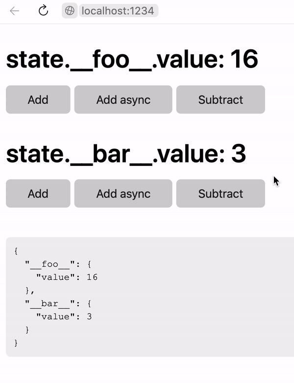

# hyperapp-starter

Hyperapp starter with TypeScript, JSX and Parcel.



```ts
export const View = () => (state: AppState) => {
    return (
        <main>
            <Counter id="__foo__" />
            <Counter id="__bar__" />
            <br />
            <pre>
                <code>{JSON.stringify(state, null, '  ')}</code>
            </pre>
        </main>
    );
};

app<AppState>({
    init: getInitialState<AppState>({}),
    view: stateProvider<AppState>(View),
    subscriptions: state => [persist(state)],
    node: document.querySelector('#app')!,
});
```

### Features

-   Using TypeScript
-   Extending library `h` function to use JSX
-   Bundling with Parcel
-   Modular system (stateful components)
-   Sync store with localStorage
-   Provide store to child components

### Installation

```bash
npm i
npm start
```
